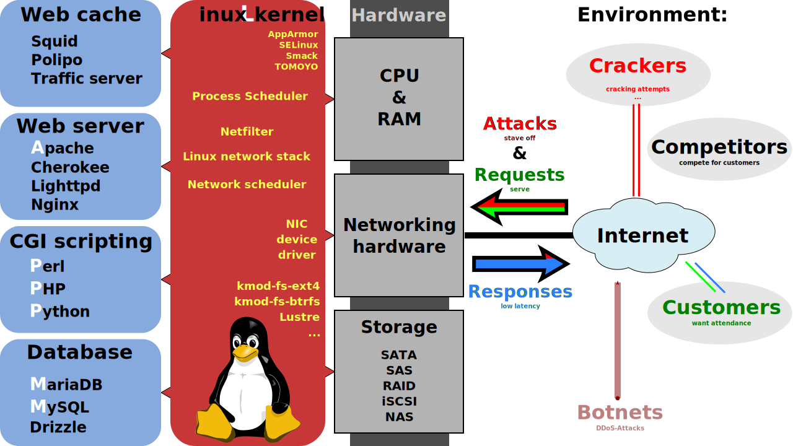

# **A Jamstack Journey**

@llyorshch
jorge@ge.org.es

---
<!-- _class: lead -->
# "I need a web page"

---
<!-- _class: lead -->
# "I already have hosting"

---
# Done! <!--fit-->

--- 
<!-- _class: lead -->

Of course not

---

# What's the matter?

--- 

# What's the matter?

--- 

### Why?

- To deliver HTML, you don't need a LAMP stack
  

---

# Enter Jamstack

---
# Jamstack Runtime Architecture

---
# Jamstack Workflow

---
# Ok but, why Jamstack?

My take on this:

* Better developer experience (Modern tools, Git, Markdown) 🤓
* No security issues → Peace of mind 💆🏻
* Damn fast 🚴🏻‍♀️💨
---
# Ok but, why Jamstack?

My take on this:

- Better developer experience (Modern tools, Git, Markdown) 🤓
- No security issues → Peace of mind 💆🏻
- Damn fast 🚴🏻‍♀️💨

But also...

* Scalability
* Portability
* Maintainability

---

# Cool. What next?

---

# (Some) Site Generators [(all)](https://jamstack.org/generators/)

|  | Tech | Leitmotif |
| --- | --- | --- |
|  | Ruby | The grandfather adopted by GitHub |
|  | Js & React | Almighty Web Dev Framework |
|  | Js & React | Also React but more CMS based |
|  | Js & Vue | For the Vue.js fans |
|  | Go | Batteries included and ready to "go" |

---

# My Choice (YMMV)

Because
* I am not a _hardcore_ Javascript developer
* I don't like Ruby (but Jekyll is nice)
* The learning curve was less overwhelming

---
# Pros and cons

| Pros | Cons |
| --- | --- |
| Good documentation | Debugging is not easy |
| The template language is simple but powerful| The abstractions are not straightforward |
| The themes are perfect for a quick start | In "Server" mode, the hugo daemon sometimes needs to be restarted |
| Working with Markdown is great | You have to know the basics of Go |
| VSCode integration |  |

--- 

# Build & Deploy options

Local environment: `hugo` command

 Github Actions

---

# Netlify

---

# Netlify CMS

---

# Github Action

---
<!-- _class: lead -->

# Demo time!
<!--
Demo Steps

- Show the structure of the site
  - content
  - Data
  - public
  - static
  - Template Layouts
  - Template plugins
  - Hugo config
  - Netlify config
  - Github actions config
- Local development
- Netlify build and deploy
- Github action build and deploy
- Netlify CMS
-->
---
<!-- _class: lead -->
<!-- _footer: https://github.com/llyorshch/jamstack-talk/ -->

# Thanks!